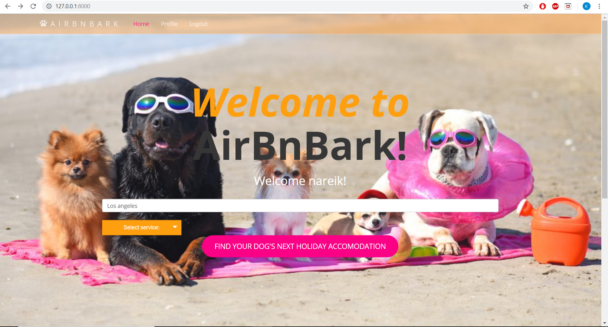

# AirBnBark Project
AirBnBark - Rango Application - UoG 2018/19 WAD2



This repository is used for the development of our AirBnBark application 

## Setup the project

```bash
# Setup virtual environment
$ pip install virtualenv
$ virtualenv venv

# Enter virtual environment
$ (UNUX) source ./venv/bin/activate
$ (WIN)  .\venv\Scripts\activate

# Install requirements & run server

$ pip install -r requirements.txt
$ python manage.py makemigrations
$ python manage.py migrate
$ python manage.py runserver
```
